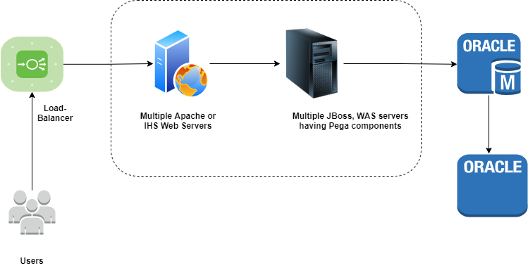
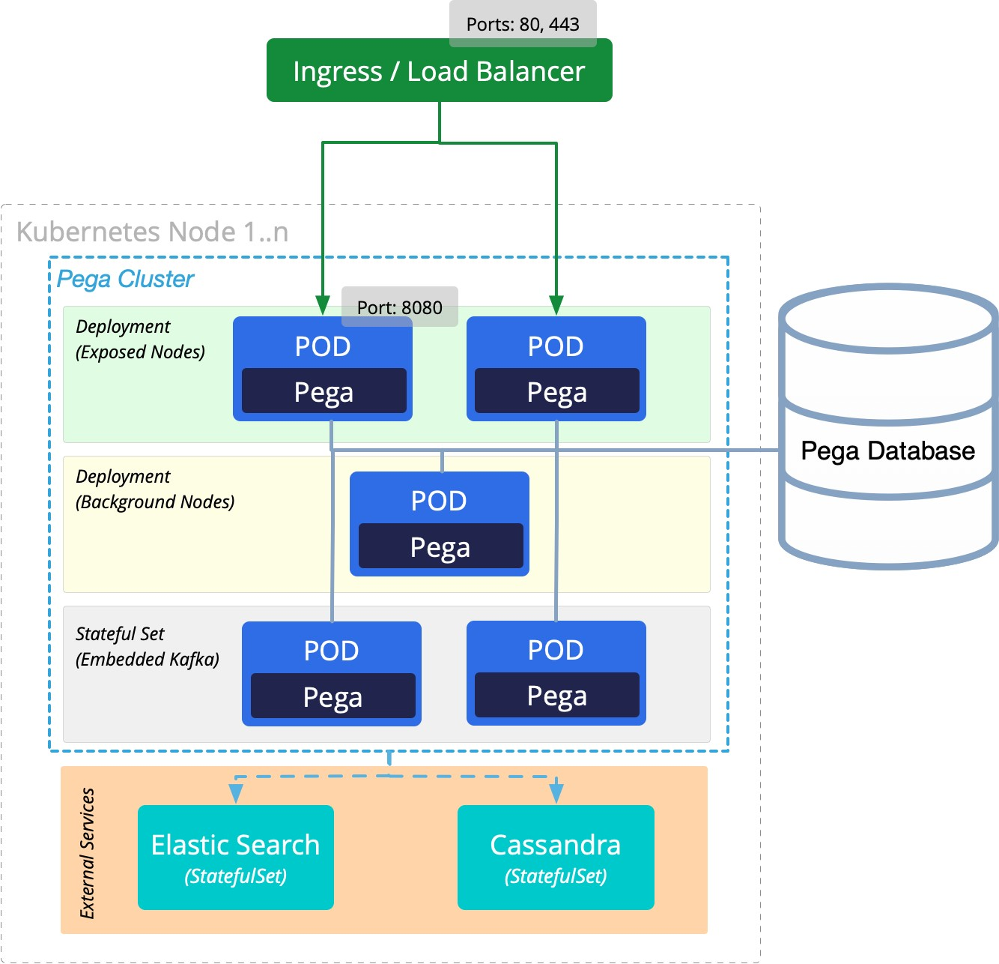
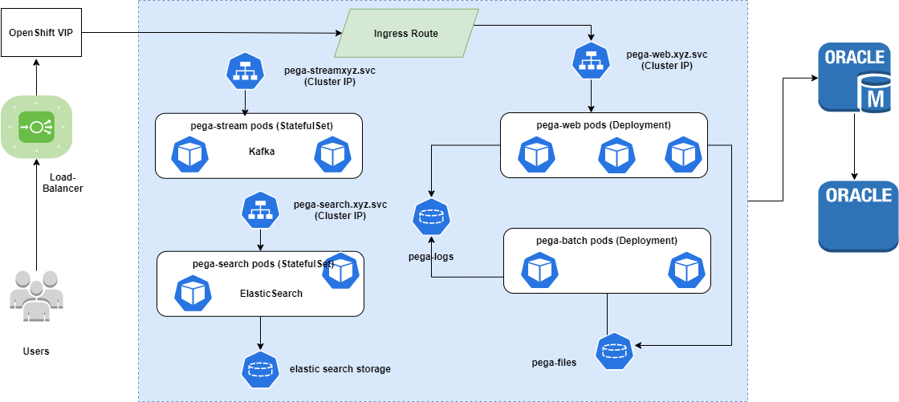

## pega-app-openshift

This project explains the architecture for Pega projects on the container platforms. Pega is a Business Process Management tool. It can be used to manage the business flows, and enables us to quickly build end to end applications

### Existing architecture

Pega 8.1 and earlier versions used to support only VMs. On Vitual machines, Pega components are deployed on J2EE servers (JBopss or WAS). 
The existing architecture can be described as:

### Proposed architecture
From 8.2.x onwards it supports the different container platforms such as (K8s, OpenShift, AKS, EKS, GKE etc.). 

On the container platform VM has been chopped into the following components:
- Web : Main UI functionality
- Batch : Background functions like agents/support for search flows
- Search : Elastic Search for work and rules
- Stream : Robustness communications using Kafka streams
- Cassnadra : Required for Decisioning & Marketing capabilities.

The detailed design comprising pods, deployment, services, ingress etc. is as follows:

### Design Decisions

### Logging

### Monitoring

### Lessons Learnt

### CI/CD Pipelines

